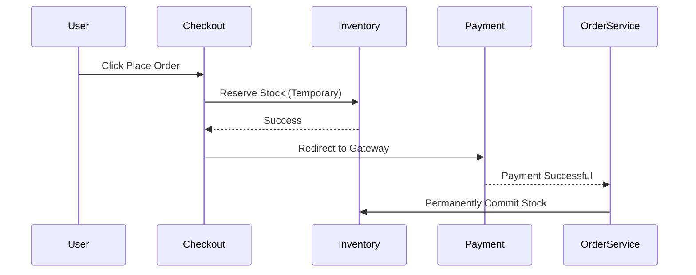

# System Design: Order Management System (OMS)

## 🏗️ Architecture



### 🖼️ Simple UI Layout (Mental Model)


## 🛠️ Technical Breakdown

### 1. Transactions (Saga Pattern)
- OMS involves multiple microservices (Order, Inventory, Payment). If payment fails, the stock must be released. We use the **Saga Pattern** for distributed transactions and rollback logic.

### 2. Frontend Complexity
- **Multi-step Forms**: Navigating between Address -> Payment -> Summary. We use state management (Zustand/Redux) to persist progress.
- **Real-time Status**: Events like "Order Packed" or "Out for Delivery" are pushed to the frontend via **SSE (Server-Sent Events)** for live progress tracking.

### 3. Idempotency Keys
- What if a user clicks 'Submit' twice? We generate a unique **Idempotency Key** on the frontend for Every session. The backend uses this to ensure only one order is created even if the request is sent multiple times.

---

### Oral Explanation (Interview Ready)

> "The critical challenges in an OMS are **Data Consistency** and **Rollback Mechanisms**. Ensuring stock is reserved correctly and released immediately upon payment failure is paramount."

3.  **Atomic Operations**: To prevent race conditions on the last available item, we implement **Row-level locking** or atomic increments at the database level.

---

## 💻 Machine Coding Solution: Frontend Idempotency Generator

This utility ensures that a user doesn't accidentally place the same order twice.

```javascript
import { v4 as uuidv4 } from 'uuid';

class OrderRequestManager {
  constructor() {
    this.currentKey = null;
    this.isSubmitting = false;
  }

  // Generate key when the checkout page loads
  initSession() {
    this.currentKey = uuidv4();
    this.isSubmitting = false;
  }

  async placeOrder(orderData) {
    if (this.isSubmitting) return;
    
    this.isSubmitting = true;
    try {
      const response = await fetch('/api/orders', {
        method: 'POST',
        headers: {
          'Content-Type': 'application/json',
          'X-Idempotency-Key': this.currentKey
        },
        body: JSON.stringify(orderData)
      });
      return await response.json();
    } finally {
      this.isSubmitting = false;
    }
  }
}
```

---

## 🧠 Deep Dive: Advanced Processes

### 1. Distributed Transactions (2PC vs Saga)
- **Two-Phase Commit (2PC)**: Blocks the database until all participating services agree. It is generally not ideal for high-scale systems due to latency.
- **Saga (Choreography/Orchestration)**: Each service completes its local transaction and emits an event. If a subsequent service fails, 'Compensating Events' are triggered to roll back changes. This is highly scalable and performant.

### 2. Inventory: Hard vs. Soft Reserve
- **Soft Reserve**: When the item is in the cart or checkout, we decrease the "Visible Stock" but don't commit it to the DB.
- **Hard Reserve**: When the payment starts, we lock the stock for 10 minutes. If payment fails, we release it. This prevents "Overselling."

### 3. Webhooks & Recovery
Payment gateways (Stripe/Razorpay) notify you of success via Webhooks.
- **The Issue**: What if the webhook fails to reach your server? 
- **The Fix**: We use a background **Poller** that checks for "Pending" orders every 15 minutes and syncs their status with the Payment Gateway API directly.

### 4. Splitting Orders
If a user buys a TV from Seller A and a Book from Seller B.
- **Process**: The OMS splits the master order into two "Sub-orders" with their own tracking IDs and shipping labels, allowing them to travel through different supply chains.
