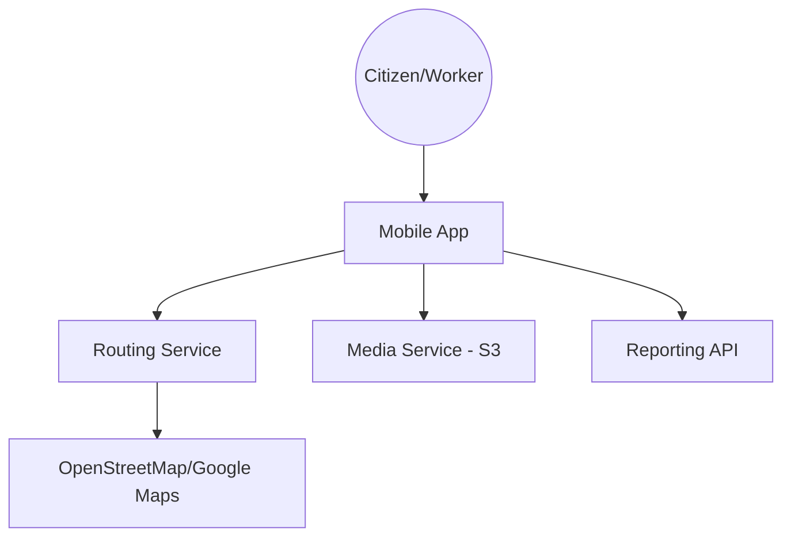
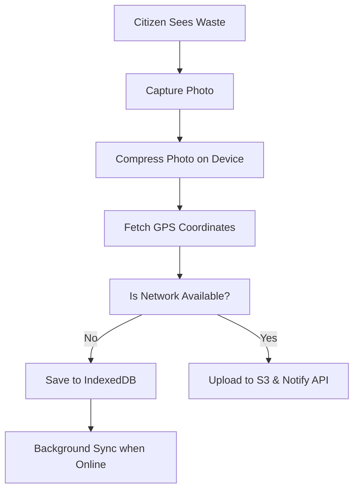

# System Design: Waste Management App (Geo-Location)

## 🏗️ Architecture



### 🖼️ Simple UI Layout (Mental Model)


### 🔄 Logic Flow: Citizen Reporting


## 🛠️ Technical Breakdown

### 1. Route Optimization
- Calculating the shortest path for waste collection trucks. Backend algorithms (e.g., Dijkstra's) optimize routes based on real-time bin fill levels (IoT sensor data).

### 2. Offline Mode (PWA/Mobile)
- Workers often operate in areas with poor connectivity. The application uses **IndexedDB/SQLite** for local storage and automatically syncs reports once a stable connection is restored.

### 3. Media Handling
- To minimize data usage, high-resolution garbage photos are **compressed on the frontend** (using Canvas or Web Workers) before being uploaded to S3.

---

### Oral Explanation (Interview Ready)

3.  **Real-time Heatmaps**: To display hotspots to administrators, we utilize **Leaflet.js** or Mapbox heatmap layers to visualize waste density.

---

## 💻 Machine Coding Solution: Frontend Image Compression

Crucial for field apps where users have slow 3G/4G connections.

```javascript
export const compressImage = (file, quality = 0.6) => {
  return new Promise((resolve) => {
    const reader = new FileReader();
    reader.readAsDataURL(file);
    reader.onload = (event) => {
      const img = new Image();
      img.src = event.target.result;
      img.onload = () => {
        const canvas = document.createElement('canvas');
        const width = img.width * quality;
        const height = img.height * quality;
        canvas.width = width;
        canvas.height = height;

        const ctx = canvas.getContext('2d');
        ctx.drawImage(img, 0, 0, width, height);

        canvas.toBlob((blob) => {
          resolve(new File([blob], file.name, { type: 'image/jpeg' }));
        }, 'image/jpeg', quality);
      };
    };
  });
};
```

---

## 🧠 Deep Dive: Advanced Processes

### 1. IoT Sensor Integration (Smart Bins)
The system doesn't just rely on reports; it uses sensors.
- **How it works**: Ultrasonic sensors in the bins measure the distance to the trash. If the distance is < 10cm, the bin is "Full."
- **Data Flow**: The sensor sends a lightweight **MQTT** message (smaller than HTTP) to the backend to trigger a route update.

### 2. Pathfinding (The Traveling Salesman)
Calculating the route for 500 bins and 10 trucks is a "Traveling Salesman Problem."
- **Heuristics**: We use algorithms like **Genetic Algorithms** or **Ant Colony Optimization** to find a "good enough" path in seconds, as a perfect path is mathematically impossible to calculate quickly.

### 3. Geofencing for Workers
How do we know the worker actually went to the bin?
- **Implementation**: We define a 20-meter "Geofence" around each bin. The worker's app marks the bin as "Collected" ONLY if their GPS coordinates were inside that circle for at least 30 seconds.

### 4. Incentivization System (Gamification)
To encourage citizens to report:
- **Tokenomics**: Each verified report earns "Green Points."
- **Verification**: Reports are verified using AI (to ensure it's actual trash) or by the collection worker when they arrive at the spot.
