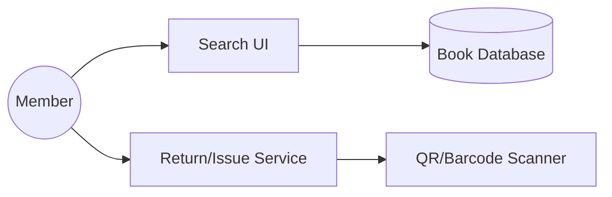
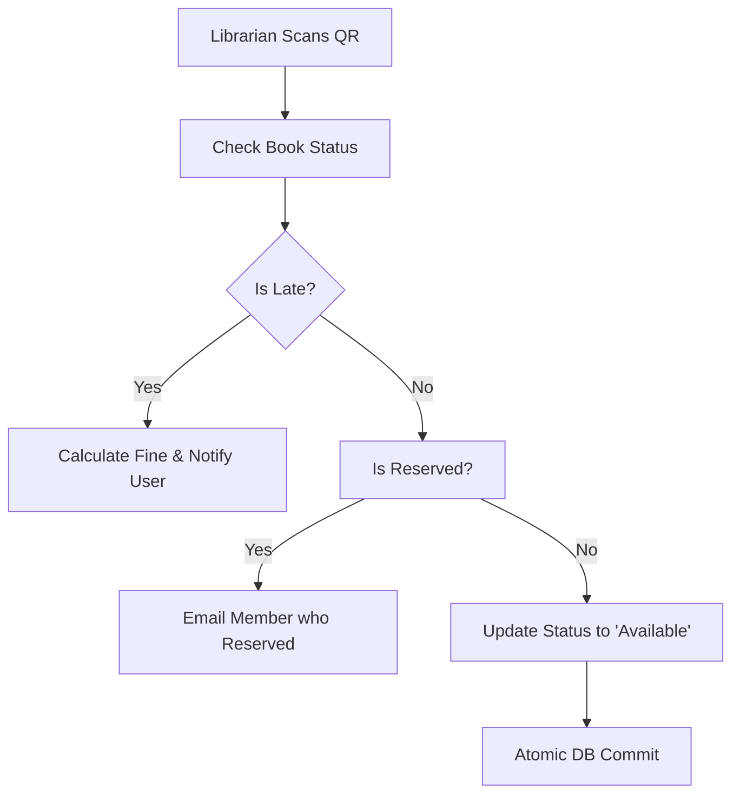

# System Design: Library Management System (LLD)

## 🏗️ Architecture



### 🖼️ Simple UI Layout (Mental Model)


### 🔄 Logic Flow: Book Return Process (Concurrency)


## 🛠️ Technical Breakdown

### 1. Catalog Search & Indexing
- Advanced filtering by Title, Author, Genre, and Availability. To ensure fast retrieval, we utilize database indexing or full-text search engines like Lucene.

### 2. Device Integration (Scanner)
- Integration with barcode/QR scanners is essential for librarians. We use libraries like `html5-qrcode` to enable camera-based scanning directly within the browser/app.

### 3. Concurrency & Locking
- Handling instances where multiple users attempt to reserve the last copy of a book. We utilize SQL transactions with appropriate **Isolation Levels** to prevent race conditions.

---

### Oral Explanation (Interview Ready)

3.  **Complex Filtering**: We utilize custom multi-select dropdowns and debounced search inputs to manage large-scale catalog filtering efficiently.

---

## 💻 Machine Coding Solution: Debounced Catalog Search

Prevents the app from querying the database on every single keystroke.

```javascript
import { useState, useEffect } from 'react';

export const useDebounce = (value, delay) => {
  const [debouncedValue, setDebouncedValue] = useState(value);

  useEffect(() => {
    const handler = setTimeout(() => {
      setDebouncedValue(value);
    }, delay);

    return () => clearTimeout(handler);
  }, [value, delay]);

  return debouncedValue;
};

// Usage in Library Component
function LibrarySearch() {
  const [searchTerm, setSearchTerm] = useState('');
  const debouncedSearchTerm = useDebounce(searchTerm, 500);

  useEffect(() => {
    if (debouncedSearchTerm) {
      console.log(`Searching for: ${debouncedSearchTerm}`);
      // Fetch books from API
    }
  }, [debouncedSearchTerm]);

  return (
    <input 
      type="text" 
      placeholder="Search books..."
      onChange={(e) => setSearchTerm(e.target.value)} 
    />
  );
}
```

---

## 🧠 Deep Dive: Advanced Processes

### 1. The Reservable vs. Issuable Logic
- **Reservable**: If a book is already issued, a user can "reserve" it. They get added to a **Priority Queue (Level 3 Deep Dive)**.
- **Issuable**: When the book is returned, it stays in a "Reserved Hold" state for 24 hours for the person who is first in the queue. Only if they don't pick it up does it become available for others.

### 2. Fine Calculation Algorithms
Fines can be complex (weekends excluded, holidays included, tiered pricing).
- **Processing**: Instead of calculating fines on-the-fly, a nightly **Cron Job** calculates the late fee for all "Overdue" books and updates the member's `balance` in the DB.

### 3. Distributed Catalogs (Inter-Library)
If Book A is in Library X but the user is in Library Y.
- **Distributed Search**: The search query hits a central index but returns the specific "Location ID" of the copy.
- **Logistics**: The OMS (Order Management) system handles the "Internal Transfer" of the book from X to Y.

### 4. Member Management & Auth
- **Digital ID**: Each member has a unique UUID linked to a Barcode. When they enter the library, a simple scanner ping updates their "Attendance" and "Active Session" status in Redis.
