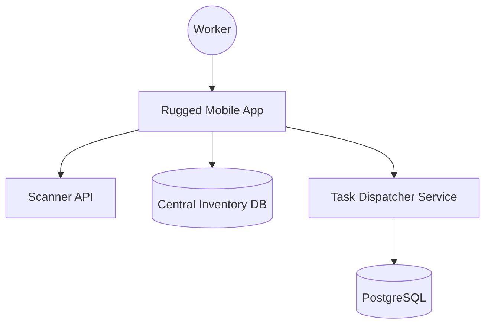
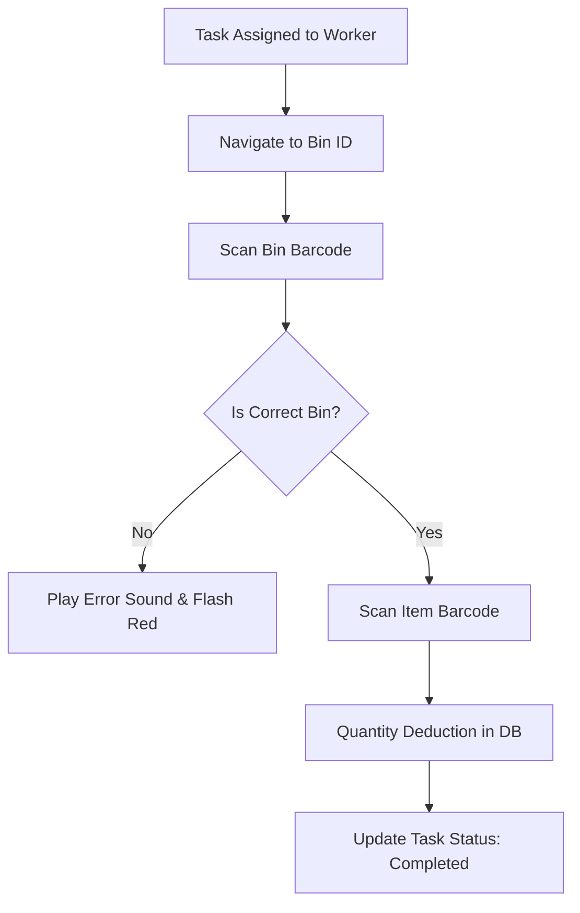

# System Design: Warehouse Management System (WMS)

## 🏗️ Architecture



### 🖼️ Simple UI Layout (Mental Model)


### 🔄 Logic Flow: Order Picking Process


## 🛠️ Technical Breakdown

### 1. High-Speed Data Entry
- Warehouse workers operate at a very high pace. The application minimizes keyboard usage, relying primarily on **Barcode scanning** (Bluetooth hardware or camera) as the main input method.
- **Audio-Visual Feedback**: Crucial for efficiency. The app provides unique "Beep" sounds and vibration patterns for successful vs. failed scans, allowing workers to stay focused on the physical items rather than the screen.

### 2. Task Dispatching & Route Optimization
- The backend dynamically assigns tasks based on the worker's current location within the warehouse (to reduce walking distance) and the priority of orders.

### 3. Concurrency & Offline Resilience
- If the network drops, scans are cached locally. For shared bins where multiple workers might be picking, we utilize real-time updates via **WebSockets** to prevent workers from empty-handed arrivals.

---

### Oral Explanation (Interview Ready)

> "In a WMS, **Worker Efficiency** and **Real-time Inventory Accuracy** are the top priorities. We utilize **Audio-Visual Feedback** loops to maximize throughput and minimize scanning errors."

3.  **UI Design**: WMS applications prioritize high-contrast elements and large touch targets, as workers may be wearing gloves or operating in low-light environments.

---

## 💻 Machine Coding Solution: Audio-Haptic Feedback Manager

Efficient warehouse work depends on non-visual cues.

```javascript
class FeedbackManager {
  constructor() {
    this.successAudio = new Audio('/sounds/success.mp3');
    this.errorAudio = new Audio('/sounds/error.mp3');
  }

  playSuccess() {
    this.successAudio.play();
    if (navigator.vibrate) {
      navigator.vibrate(100); // Shorter vibration
    }
  }

  playError() {
    this.errorAudio.play();
    if (navigator.vibrate) {
      navigator.vibrate([200, 100, 200]); // Patterned vibration
    }
  }
}

// Integration with Scanner logic
const scanner = (code) => {
  const feedback = new FeedbackManager();
  if (validateCode(code)) {
    feedback.playSuccess();
  } else {
    feedback.playError();
  }
};
```

---

## 🧠 Deep Dive: Advanced Processes

### 1. Order Batching & Waves
Instead of picking one order at a time, we use **Wave Picking**.
- **Process**: The system identifies 10 orders that all need items from the same "Zone." It sends one worker to collect all those items in one trip, which are later sorted at the packing station.

### 2. Space Optimization (Binning)
How do we decide where to put new inventory?
- **Velocity Tracking**: "Hot" items (high sales volume) are moved to the front of the warehouse (near the docks) automatically. "Cold" items are stored in deeper areas.

### 3. Cycle Counting
To ensure 100% inventory accuracy without stopping the warehouse.
- **Process**: The system creates small, daily "Counting Tasks." A worker is asked to count only 5 random bins per day. Over a month, every single bin in the warehouse gets verified.

### 4. Integration with Robotics
Modern WMS must talk to Automated Guided Vehicles (AGVs).
- **Communication**: The WMS sends a JSON command to the Robot Fleet Manager via a **Message Broker (RabbitMQ)**, instructing a robot to move bin X to station Y.
