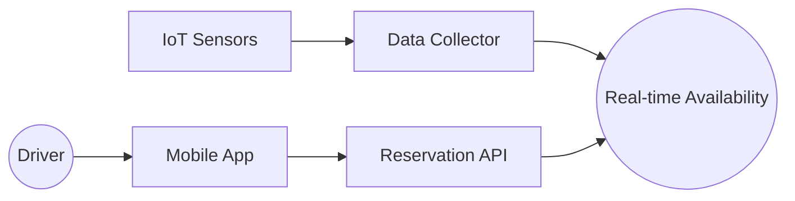
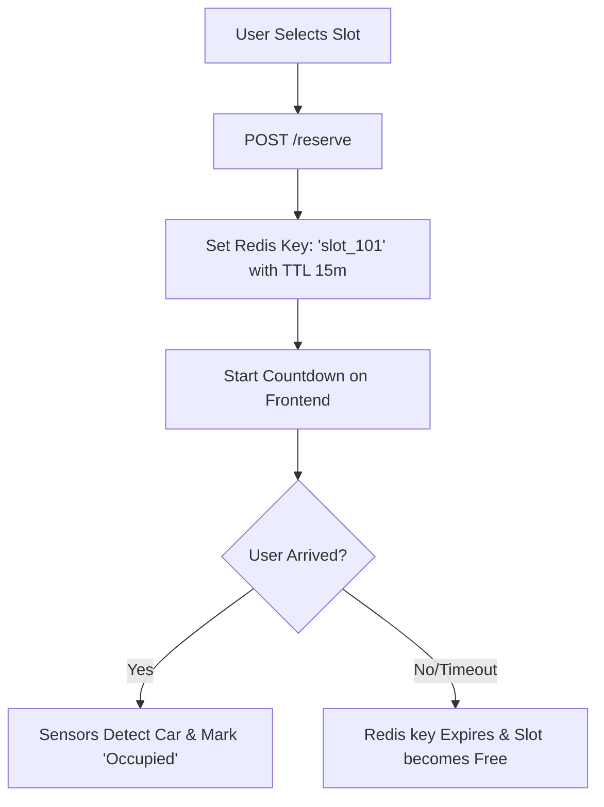

# System Design: Parking Lot Reservation (Real-time)

## 🏗️ Architecture



### 🖼️ Simple UI Layout (Mental Model)


### 🔄 Logic Flow: Reservation Lifecycle


## 🛠️ Technical Breakdown

### 1. Real-time Slot Availability
- **IoT Sensors**: Ultrasonic or ground-loop sensors detect the presence of a vehicle. This occupancy data is pushed to the application via **WebSockets** or **MQTT** for near-instant updates.
- **Visual Mapping**: The floor layout is rendered using **SVG** or **Canvas**. SVG is preferred for its ability to handle interactive, addressable slot IDs.

### 2. Dynamic Pricing Algorithms
- To maximize revenue, pricing is adjusted based on occupancy thresholds (e.g., prices increase when capacity exceeds 90%).

### 3. Reservation Management
- **Grace Period**: To prevent deadlocks, bookings include a mandatory grace period (e.g., 15 minutes). If the vehicle is not detected within this window, the reservation is automatically voided.

---

### Oral Explanation (Interview Ready)

3.  **Scalability**: For multi-regional deployments, we utilize **Edge Computing** to minimize response times for local sensor data processing.

---

## 💻 Machine Coding Solution: Countdown Timer for Reservations

A critical UX feature to show the user how much time they have to reach the slot.

```javascript
import { useState, useEffect } from 'react';

export const useParkingTimer = (initialMinutes) => {
  const [seconds, setSeconds] = useState(initialMinutes * 60);

  useEffect(() => {
    if (seconds <= 0) return;

    const interval = setInterval(() => {
      setSeconds(prev => prev - 1);
    }, 1000);

    return () => clearInterval(interval);
  }, [seconds]);

  const formatTime = () => {
    const mins = Math.floor(seconds / 60);
    const secs = seconds % 60;
    return `${mins}:${secs < 10 ? '0' : ''}${secs}`;
  };

  return { timeRemaining: formatTime(), isExpired: seconds <= 0 };
};
```

---

## 🧠 Deep Dive: Advanced Processes

### 1. ANPR (Automatic Number Plate Recognition)
How do we know the right car entered?
- **Integration**: A camera at the gate captures the plate image.
- **Processing**: We use an **OCR (Optical Character Recognition)** service to match the plate with the reservation ID in the database before opening the barrier.

### 2. Handling Sensor Noise (Ghost Occupancy)
Sensors can sometimes fail or detect small objects as cars.
- **Triage**: We don't update the status based on one packet. The sensor must report "Occupied" for at least 5 consecutive seconds to be verified.

### 3. Offline Gate Entry
What if the cloud is down?
- **Solution**: The local gate controller keeps a 24-hour cache of all active reservations. Even without internet, it can verify your QR code or Number Plate locally.

### 4. Overstay Management
If a user stays beyond their booking.
- **Enforcement**: The system sends a push notification the moment the sensor detects occupancy post-expiry. If not moved, the billing switches to "Penalty Rates" (tiered pricing).
