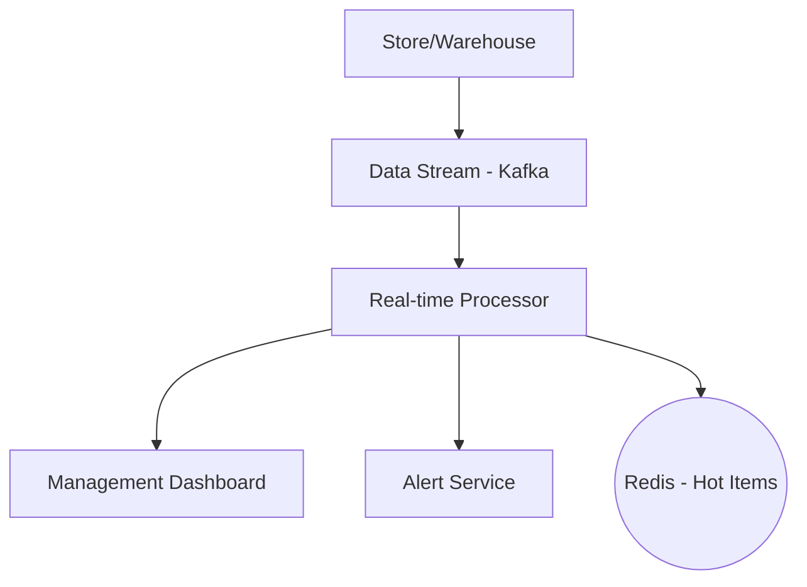
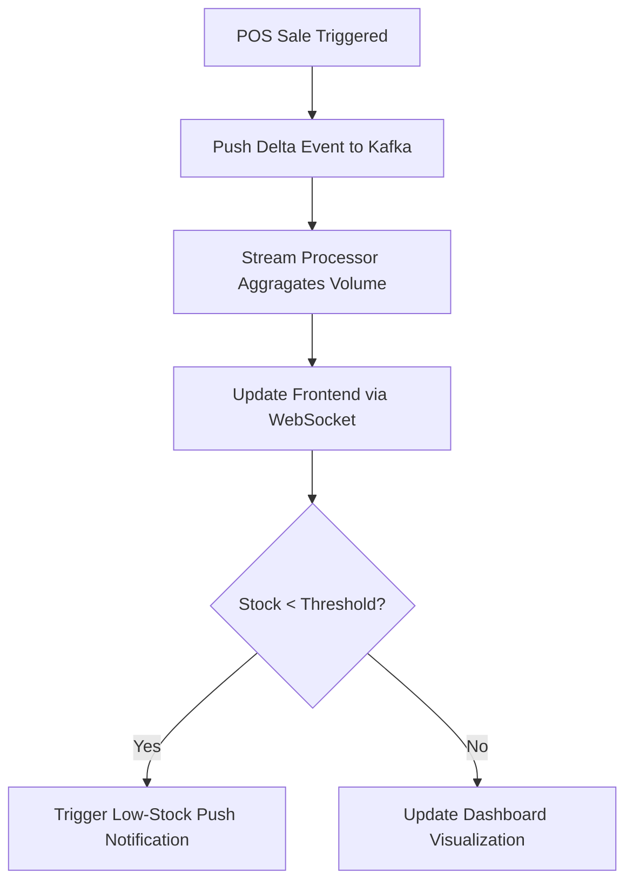

# System Design: Real-time Inventory Tracking

## 🏗️ Architecture



### 🖼️ Simple UI Layout (Mental Model)


### 🔄 Logic Flow: Real-time Stock Sync


## 🛠️ Technical Breakdown

### 1. High Throughput & Event Streaming
- Large retail chains generate thousands of sales events per minute. To avoid database degradation, we push events to **Kafka** and perform background aggregations.
- **Delta Updates**: Instead of transmitting the entire dataset, the frontend receives only modified values (e.g., `{ id: 101, stock: 99 }`) to save bandwidth.

### 2. Low Latency Data Visualization
- **Throttling Graph Renders**: Continuous updates (e.g., every 100ms) can crash the browser. We batch incoming updates and re-render charts at a stabilized 60fps using `requestAnimationFrame`.

### 3. Automated Alerts
- Threshold-based triggers ensure that "Low Stock" alerts are dispatched to procurement teams the moment the count dips below a safe safety-stock level.

---

### Oral Explanation (Interview Ready)

3.  **Efficiency**: For high-frequency data streams, utilizing **gRPC-Web** or **Protobuf** as a serialization format is standard for minimizing payload size.

---

## 💻 Machine Coding Solution: Web Worker for Data Processing

Processing 10,000 inventory updates/sec shouldn't freeze the main UI thread.

```javascript
// worker.js
self.onmessage = function(e) {
  const updates = e.data;
  // Complex calculation: Aggregating stock by region
  const aggregated = updates.reduce((acc, curr) => {
    acc[curr.region] = (acc[curr.region] || 0) + curr.quantity;
    return acc;
  }, {});
  
  postMessage(aggregated);
};

// Main Component
const worker = new Worker('worker.js');
worker.onmessage = (e) => {
  updateDashboardChart(e.data); // Clean data for UI
};
```

---

## 🧠 Deep Dive: Advanced Processes

### 1. Dead Letter Queues (DLQ)
What if an inventory update is malformed?
- **Process**: We don't want to stop the whole stream. We catch the error and move that specific message to a **Dead Letter Queue (Kafka)** for manual inspection by engineers, while the rest of the updates continue.

### 2. Consistent Hashing for Scaling
- **How it works**: We split the inventory into "Shards" (e.g., Shard 1 for IDs 1-1k, Shard 2 for 1k-2k).
- **Benefit**: This allows us to scale horizontally. If we have 10 million products, we just add more database nodes and use consistent hashing to know exactly which node holds which product.

### 3. "Click-to-Ship" Real-time Pipeline
The moment you click "Buy" on the website:
- **Flow**: The message travels through Kafka -> Warehouse App -> Picker's Tablet in < 500ms. This speed is what allows companies like Amazon to offer prime-day speed.

### 4. Cache Sideline Pattern
- **Logic**: We check Redis first. If the item isn't there (Cache Miss), we fetch from SQL and synchronously update Redis for the next user. This keeps "Hot" items (like new iPhones) extremely fast for millions of users.
