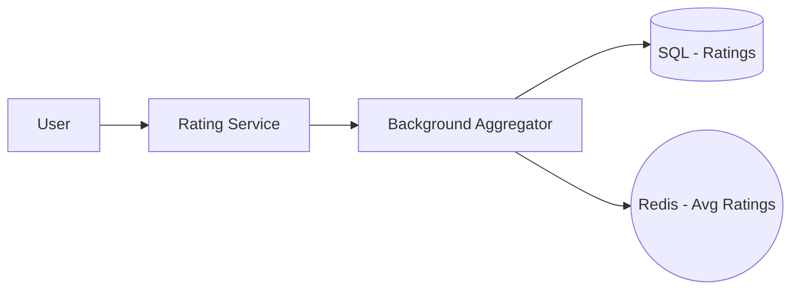
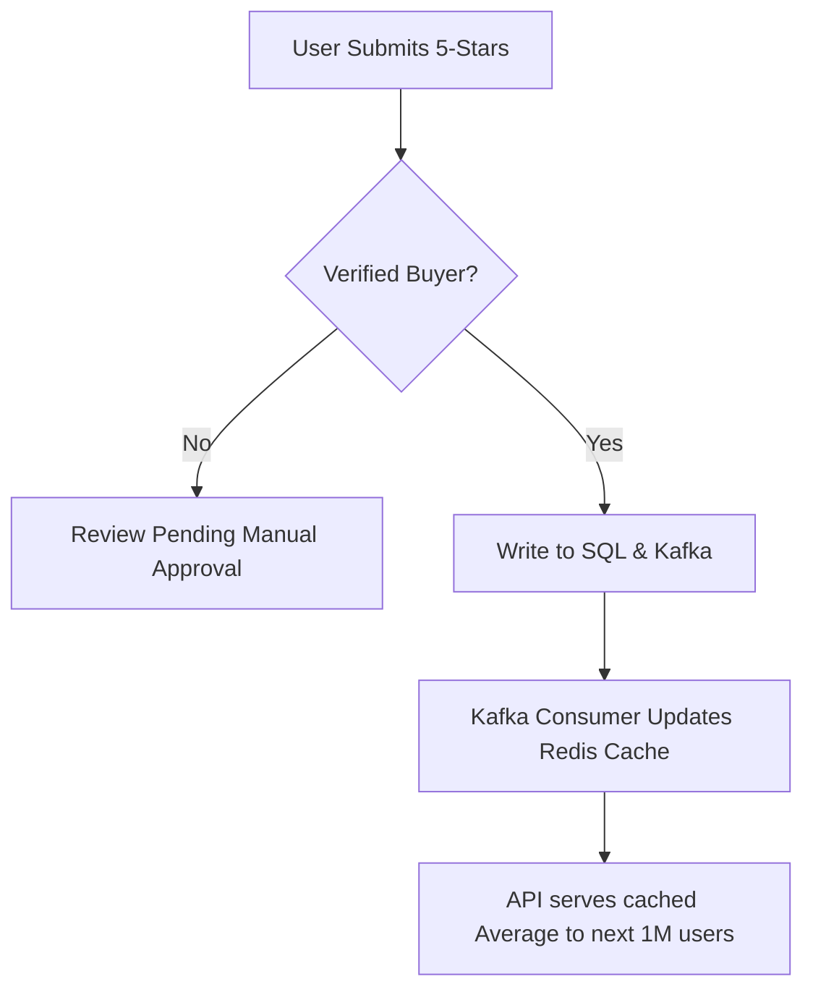

# System Design: E-commerce Rating System

## 🏗️ Architecture



### 🖼️ Simple UI Layout (Mental Model)


### 🔄 Logic Flow: Rating Submission & Aggregation


## 🛠️ Technical Breakdown

### 1. Anti-Spam & Trust Mechanisms
- **Verified Purchase Requirement**: Restrict rating capabilities to users who have a confirmed purchase history for the specific product.
- **Weighted Averages**: Not all reviews are equal. We assign higher weights to long-term members or "Top Reviewers" and lower weights to suspicious or newly created accounts.

### 2. Aggregation Strategy (Pre-computation)
- Calculating `AVG(stars)` on-the-fly across millions of rows is inefficient. We utilize background workers (running on a schedule or triggered by Kafka) to pre-calculate and store the average rating and distribution (1-5 star counts) in Redis.

### 3. Frontend / UI Implementation
- **Accessibility**: Rating components must be navigable via keyboard and include appropriate `aria-label` tags for screen readers.
- **Optimistic UI**: We provide immediate visual feedback upon submission, syncing with the server asynchronously to ensure a perceived zero-latency experience.

---

### Oral Explanation (Interview Ready)

3.  **Trust Signals**: Enabling a 'Was this helpful?' feature allows the community to promote high-quality, authentic reviews to the top.

---

## 💻 Machine Coding Solution: Accessible Rating Component

A standard machine coding problem involving hover states and accessibility.

```javascript
import React, { useState } from 'react';

const Rating = ({ totalStars = 5 }) => {
  const [rating, setRating] = useState(0);
  const [hover, setHover] = useState(0);

  return (
    <div className="star-rating">
      {[...Array(totalStars)].map((_, index) => {
        const starValue = index + 1;
        return (
          <button
            key={index}
            className={starValue <= (hover || rating) ? 'on' : 'off'}
            onClick={() => setRating(starValue)}
            onMouseEnter={() => setHover(starValue)}
            onMouseLeave={() => setHover(0)}
            aria-label={`${starValue} out of ${totalStars} stars`}
          >
            <span className="star">&#9733;</span>
          </button>
        );
      })}
    </div>
  );
};
```

---

## 🧠 Deep Dive: Advanced Processes

### 1. Sentiment Analysis (NLP)
We don't just count stars; we read the text.
- **Process**: Reviews are passed through a **Natural Language Processing (NLP)** pipeline. 
- **Benefit**: If a user gives 5 stars but the text says "Horrible, never buy," the system flags it as a "Sentiment Mismatch" for manual review.

### 2. Protecting Against "Rating Attacks"
Competitors might hire bots to post 10,000 bad reviews in an hour.
- **Anomaly Detection**: We monitor for "Rating Spikes." If a product's review volume increases by 1000% suddenly, the system automatically shifts to "Review Approval Mode" and halts the average calculation.

### 3. Storing Review Multimedia correctly
- **Storage**: Photos and Videos are stored in **Object Storage (S3)**. 
- **Metadata**: The database only stores the URL and a few technical metadata points (filesize, resolution). 

### 4. Cold Start for Products
New products often lack reviews, leading to low consumer trust and fewer sales—a classic "Cold Start" problem.
- **Solution**: "Vine" or "Incentivized Review" programs. The system flags these reviews as "Received free product" to maintain legal and ethical transparency.
